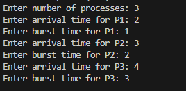
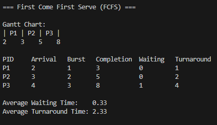
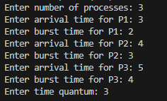
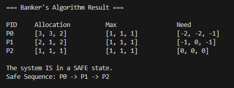

# CPU Scheduling & Banker's Algorithm Simulator

A console-based Python program that simulates CPU scheduling algorithms
(FCFS and Round Robin) and checks system safety using the Banker's
Algorithm.

## Features

- **First Come First Serve (FCFS)** — non-preemptive scheduling
- **Round Robin (RR)** — preemptive scheduling with a configurable time quantum
- **Banker's Algorithm** — safe/unsafe state detection with safe sequence output
- Text-based Gantt Chart for both scheduling algorithms
- Average Waiting Time and Average Turnaround Time calculation

## Requirements

- Python 3.7 or later (no external libraries required)

## How to Run

1. Open a terminal in the folder containing `scheduling_sim.py`.
2. Run:
   ```
   python scheduling_sim.py
   ```
   (use `python3` instead of `python` on macOS/Linux if needed)
3. Choose an option from the menu:
   ```
   1. First Come First Serve (FCFS) - Non-preemptive
   2. Round Robin (RR) - Preemptive
   3. Banker's Algorithm - Safe State Check
   4. Exit
   ```
4. Follow the prompts to enter the required values (number of processes,
   arrival/burst times, time quantum, or the Banker's Algorithm matrices).

---

## Sample Run 1: FCFS

### Input



### Output



## Sample Run 2: Round Robin

### Input



### Output


## Sample Run 3: Banker's Algorithm

### Output


